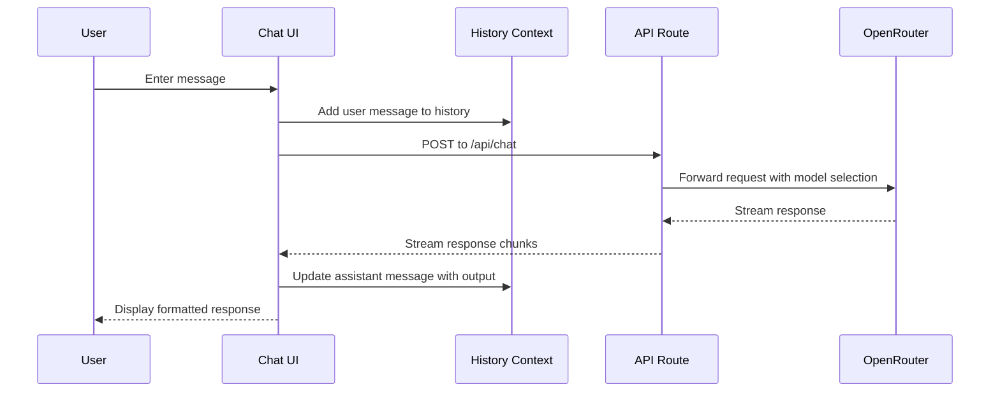
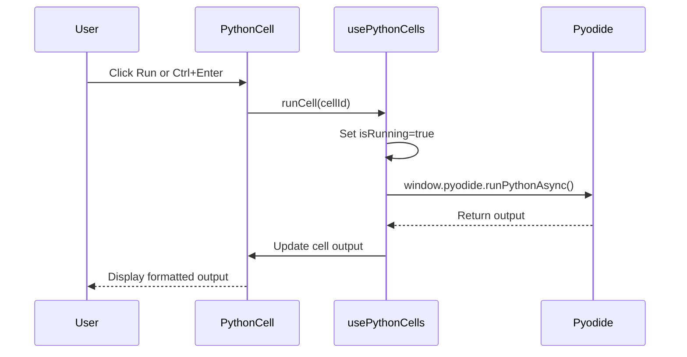

# Santosh Puram's AI Tools - Technical Documentation

This document provides comprehensive technical documentation for all applications within Santosh Puram's AI Tools platform.

## Table of Contents

- [AI Chat Application](./ai-chat-docs.md)
- [Code Editor Application](./code-editor-docs.md)
- [Landing Page](#landing-page)
- [API Routes](./api-docs.md)

---

## AI Chat Application

### Overview

The AI Chat application is a feature-rich chatbot interface that connects to various AI models via OpenRouter. It provides a Claude/Perplexity-like experience with conversation history, model selection, and professional output formatting.

### Architecture

```
features/ai-chat/
├── components/
│   ├── MessageBubble.tsx        # Individual message display component
│   └── SettingsModal.tsx        # Model and parameter configuration modal
├── lib/
│   ├── chat-history-context.tsx # Conversation history management (React Context)
│   ├── models.ts                # Available models and configurations
│   └── model-utils.ts           # Model utility functions
├── types.ts                     # TypeScript type definitions
├── index.ts                     # Public exports
└── ai-chat-docs.md              # Detailed documentation
```

### Key Features

1. **Multiple AI Models**: Access to OpenRouter's free models
2. **Conversation History**: Persistent history with sidebar navigation
3. **Model Indicator**: UI display showing current model being used
4. **Token Usage Tracking**: Real-time token usage display
5. **Copy Output**: One-click copy for generated responses
6. **Professional Output**: Formatted, structured response display
7. **Status Bar**: Shows model activity and processing status

### Data Flow



### API Integration

The chat communicates with OpenRouter via the `/app/api/chat/route.ts` endpoint:

- **Method**: POST
- **Headers**: Authorization, Content-Type
- **Body**: `{ messages: [], model: string }`
- **Response**: Streaming text response

### Context Providers

```tsx
// ChatHistoryProvider wraps the application
<ChatHistoryProvider>
  <SettingsModal />
  <ChatInterface />
</ChatHistoryProvider>
```

The context provides:
- `conversations`: Array of all conversations
- `activeConversation`: Currently selected conversation
- `addConversation`: Create new conversation
- `updateConversation`: Update existing conversation
- `deleteConversation`: Remove conversation

---

## Code Editor Application

### Overview

The Code Editor application provides a full-featured online code editing environment with support for multiple languages (HTML, CSS, JavaScript, Python, C#, Java). Python editing is available in both "Classic" (single editor) and "Colab" (cell-based) modes.

### Architecture

```
features/code-editor/
├── components/
│   ├── CodeEditor.tsx           # Monaco-based code editor component
│   ├── LanguageDropdown.tsx     # Language selector dropdown
│   └── PythonCell.tsx           # Google Colab-style cell component
├── lib/
│   ├── usePythonCells.ts        # Hook for cell-based Python editing
│   ├── web-templates.ts         # HTML/CSS/JS starter templates
│   ├── python-template.ts       # Python starter template
│   ├── csharp-template.ts       # C# starter template
│   └── java-template.ts         # Java starter template
├── types.ts                     # TypeScript type definitions
├── index.ts                     # Public exports
└── code-editor-docs.md          # Detailed documentation
```

### Key Features

1. **Multi-Language Support**: HTML, CSS, JavaScript, Python, C#, Java
2. **Monaco Editor**: Full-featured VS Code editor in the browser
3. **Python Colab Mode**: Cell-based execution similar to Google Colab
4. **Python Classic Mode**: Traditional single-editor with output panel
5. **Live Preview**: HTML/CSS/JS real-time preview
6. **Pyodide Integration**: Client-side Python execution

### Python Colab Mode

The cell-based interface includes:

- **Individual Cells**: Each cell has its own editor, run button, and output
- **Keyboard Shortcut**: Ctrl+Enter to run cell
- **Cell Management**: Add, delete, move cells up/down
- **Independent Execution**: Each cell runs in isolation
- **Output Display**: Output shown below each cell

### Modes

| Mode | Description |
|------|-------------|
| Colab | Cell-based Python editing with individual cell outputs |
| Classic | Single editor with shared output panel |
| Web | HTML/CSS/JS with live preview panel |

### Python Execution Flow



---

## Landing Page

### Overview

The landing page serves as the entry point for Santosh Puram's AI Tools platform. It features a clean, modern interface with quick access to both the AI Chat and Code Editor applications.

### Architecture

```
app/
├── page.tsx                     # Landing page component
├── layout.tsx                   # Root layout with providers
└── globals.css                  # Global styles
```

### Key Features

1. **Dual Application Access**: Icons for AI Chatbot and Code Editor
2. **Modern UI**: Clean, responsive design with Tailwind CSS
3. **Navigation**: Direct links to `/ai-chat` and `/editor`

---

## Test Coverage

The project includes comprehensive test coverage:

- **Unit Tests**: Component and utility testing with Jest
- **Integration Tests**: API route testing
- **Feature Tests**: Full feature workflow testing

Run tests with:
```bash
npm test
npm run test:watch
npm run test:coverage
```

---

## Development

### Prerequisites
- Node.js 18+
- npm or yarn

### Installation
```bash
npm install
```

### Development Server
```bash
npm run dev
```

### Build
```bash
npm run build
```

### Linting
```bash
npm run lint
```

---

## Project Structure

```
/vercel/sandbox/
├── app/                        # Next.js App Router
│   ├── api/                    # API routes
│   ├── ai-chat/                # AI chat page
│   ├── editor/                 # Code editor page
│   └── page.tsx                # Landing page
├── features/                   # Feature modules
│   ├── ai-chat/                # AI chat feature
│   └── code-editor/            # Code editor feature
├── shared/                     # Shared utilities
├── docs/                       # Documentation
└── node_modules/
```

---

## Related Documentation

- [AI Chat Documentation](./ai-chat-docs.md)
- [Code Editor Documentation](./code-editor-docs.md)